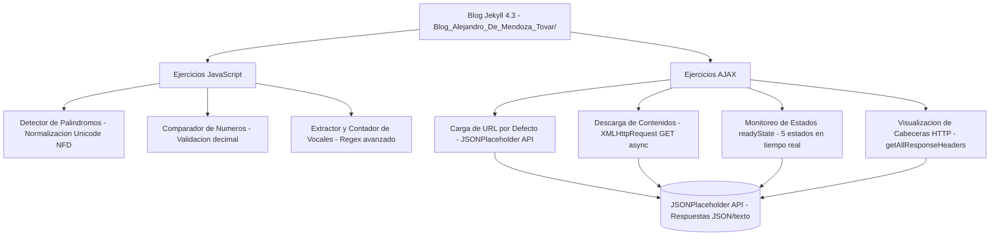

<div align="center">

# 🚀 Laboratorio JavaScript y AJAX

## Desarrollo de Aplicaciones Web Interactivas


</div>

---

---

## 📋 Tabla de Contenidos

- [Descripción](#-descripción)
- [Características](#-características)
- [Requisitos Previos](#-requisitos-previos)
- [Instalación](#-instalación)
- [Ejecución del Proyecto](#-ejecución-del-proyecto)
- [Estructura del Proyecto](#-estructura-del-proyecto)
- [Ejercicios Implementados](#-ejercicios-implementados)
- [Uso de la Aplicación](#-uso-de-la-aplicación)
- [Tecnologías Utilizadas](#-tecnologías-utilizadas)
- [Problemas Conocidos](#-problemas-conocidos)
- [Contribuciones](#-contribuciones)
- [Autor](#-autor)
- [Licencia](#-licencia)

---

## 📖 Descripción

Este proyecto es un **laboratorio académico** desarrollado para la asignatura de **Desarrollo de Aplicaciones en Red**, que implementa ejercicios prácticos de **JavaScript** y **AJAX** integrados en un blog personal creado con **Jekyll**.

El laboratorio demuestra competencias en:

- ✅ Manipulación del DOM
- ✅ Validación de datos con JavaScript
- ✅ Expresiones regulares avanzadas
- ✅ Peticiones asíncronas con XMLHttpRequest
- ✅ Manejo de estados HTTP
- ✅ Procesamiento de respuestas JSON

---

## ✨ Características

### 🔹 Ejercicios JavaScript

1. **Detector de Palíndromos**

   - Normalización Unicode (NFD)
   - Eliminación de tildes y caracteres especiales
   - Comparación bidireccional de cadenas

2. **Comparador de Números**

   - Validación de entrada numérica
   - Soporte para números decimales
   - Mensajes contextuales según resultado

3. **Extractor de Vocales**

   - Uso de expresiones regulares
   - Captura de vocales con y sin tildes
   - Visualización ordenada de resultados

4. **Contador de Vocales**
   - Conteo individual de cada vocal
   - Normalización de texto para precisión
   - Presentación visual con gráficos de barras

### 🔹 Ejercicios AJAX

1. **Carga de URL por Defecto**

   - URL predeterminada al cargar la página
   - Ejemplo: JSONPlaceholder API

2. **Descarga de Contenidos**

   - Petición GET asíncrona
   - Procesamiento de respuestas JSON y texto
   - Manejo de errores y CORS

3. **Monitoreo de Estados**

   - Visualización de los 5 estados readyState
   - Actualización en tiempo real
   - Timestamps de cada cambio de estado

4. **Visualización de Cabeceras HTTP**

   - Extracción con `getAllResponseHeaders()`
   - Formato legible para el usuario
   - Detección de restricciones CORS

5. **Código y Texto de Estado**
   - Visualización del código HTTP (200, 404, etc.)
   - Texto descriptivo del estado
   - Indicadores visuales de éxito/error

---

## 🔧 Requisitos Previos

Asegúrate de tener instalados los siguientes componentes:

### Windows

```powershell
# Ruby (versión 3.0 o superior)
winget install RubyInstallerTeam.RubyWithDevKit.3.2

# Bundler (instalado automáticamente con Ruby)
gem install bundler

# Jekyll
gem install jekyll
```

### macOS

```bash
# Ruby (ya viene preinstalado, o usar Homebrew)
brew install ruby

# Bundler y Jekyll
gem install bundler jekyll
```

### Linux (Ubuntu/Debian)

```bash
# Ruby y dependencias
sudo apt update
sudo apt install ruby-full build-essential zlib1g-dev

# Bundler y Jekyll
gem install bundler jekyll
```

---

## 📦 Instalación

### 1. Clonar el Repositorio

```bash
git clone https://github.com/tu-usuario/laboratorio-js-ajax.git
cd laboratorio-js-ajax
```

### 2. Instalar Dependencias

```bash
bundle install
```

Este comando instalará todas las gemas necesarias definidas en el `Gemfile`:

- `jekyll` (~> 4.3.0)
- `jekyll-theme-cayman`
- `jekyll-feed`

### 3. Verificar Instalación

```bash
bundle exec jekyll --version
```

Deberías ver algo como: `jekyll 4.3.0`

---

## 🚀 Ejecución del Proyecto

### Modo Desarrollo (con auto-recarga)

```bash
bundle exec jekyll serve
```

Salida esperada:

```
Configuration file: .../_config.yml
            Source: .../Blog_Alejandro_De_Mendoza_Tovar
       Destination: .../Blog_Alejandro_De_Mendoza_Tovar/_site
 Incremental build: disabled
      Generating...
                    done in 1.2 seconds.
 Auto-regeneration: enabled
    Server address: http://127.0.0.1:4000
  Server running... press ctrl-c to stop.
```

### Acceder a la Aplicación

Abre tu navegador y visita:

- **Página Principal:** [http://127.0.0.1:4000/](http://127.0.0.1:4000/)
- **Laboratorio JS/AJAX:** [http://127.0.0.1:4000/laboratorio-js-ajax/](http://127.0.0.1:4000/laboratorio-js-ajax/)

### Modo Producción (build estático)

```bash
bundle exec jekyll build
```

Los archivos generados estarán en la carpeta `_site/`

### Detener el Servidor

Presiona `Ctrl + C` en la terminal.

---

## 📁 Estructura del Proyecto

```
Blog_Alejandro_De_Mendoza_Tovar/
│
├── _config.yml                  # Configuración de Jekyll
├── Gemfile                      # Dependencias del proyecto
├── Gemfile.lock                 # Versiones exactas de gemas
├── README.md                    # Este archivo
│
├── _includes/                   # Componentes reutilizables
│   ├── header.html             # Header con navegación
│   └── footer.html             # Footer del sitio
│
├── _layouts/                    # Plantillas de página
│   ├── default.html            # Layout principal
│   └── post.html               # Layout para posts
│
├── _posts/                      # Artículos del blog
│   ├── 2025-10-26-introduccion-al-blog.md
│   ├── 2025-10-27-desarrollo-web-moderno.md
│   └── 2025-10-28-inteligencia-artificial.md
│
├── assets/                      # Recursos estáticos
│   ├── css/
│   │   ├── style.scss          # Estilos principales
│   │   └── custom.css          # Estilos personalizados
│   └── images/                 # Imágenes del blog
│
├── laboratorio-js-ajax.html    # ⭐ Página del laboratorio
├── index.html                   # Página de inicio
├── blog.md                      # Lista de posts
├── about.md                     # Página Acerca de
│
└── _site/                       # Sitio generado (no versionar)
```

---

## 🎯 Ejercicios Implementados

### JavaScript (4 ejercicios)

| #   | Ejercicio      | Descripción                             | Técnicas Utilizadas                     |
| --- | -------------- | --------------------------------------- | --------------------------------------- |
| 1   | **Palíndromo** | Detecta si una cadena es palíndromo     | `normalize()`, `replace()`, `reverse()` |
| 2   | **Comparador** | Compara dos números y muestra el mayor  | `parseFloat()`, `isNaN()`, validación   |
| 3   | **Extractor**  | Extrae vocales de una frase             | Regex: `/[aeiouáéíóúAEIOUÁÉÍÓÚ]/g`      |
| 4   | **Contador**   | Cuenta cuántas veces aparece cada vocal | `match()`, normalización, conteo        |

### AJAX (5 ejercicios)

| #   | Ejercicio         | Descripción                          | API Utilizada                  |
| --- | ----------------- | ------------------------------------ | ------------------------------ |
| 1   | **URL Default**   | Muestra URL predeterminada al cargar | `window.onload`                |
| 2   | **Descarga**      | Realiza petición y muestra contenido | `XMLHttpRequest.send()`        |
| 3   | **Estados**       | Monitorea readyState en tiempo real  | `onreadystatechange`           |
| 4   | **Cabeceras**     | Extrae y muestra headers HTTP        | `getAllResponseHeaders()`      |
| 5   | **Código Estado** | Muestra código y texto de respuesta  | `xhr.status`, `xhr.statusText` |

---

## 💻 Uso de la Aplicación

### Ejercicio 1: Detector de Palíndromos

1. Ingresa una palabra o frase (ej: "anita lava la tina")
2. Haz clic en **"Verificar Palíndromo"**
3. Observa el resultado con análisis detallado

**Casos de prueba:**

```
✅ "Anita lava la tina" → ES palíndromo
✅ "Reconocer" → ES palíndromo
❌ "Hola mundo" → NO es palíndromo
```

### Ejercicio 2: Comparador de Números

1. Ingresa dos números (decimales permitidos)
2. Haz clic en **"Comparar Números"**
3. Ve cuál es mayor o si son iguales

**Casos de prueba:**

```
42 y 38 → 42 es MAYOR
3.14 y 3.15 → 3.15 es MAYOR
10 y 10 → Ambos son IGUALES
```

### Ejercicio 3: Extractor de Vocales

1. Ingresa una frase
2. Haz clic en **"Mostrar Vocales"**
3. Observa la lista de vocales encontradas

**Ejemplo:**

```
Entrada: "Desarrollo web moderno"
Salida: e - a - o - o - e - o - e - o (8 vocales)
```

### Ejercicio 4: Contador de Vocales

1. Ingresa una frase
2. Haz clic en **"Contar Vocales"**
3. Ve el conteo individual con gráficos

**Ejemplo:**

```
Entrada: "JavaScript es fantástico"
Salida:
  A: 4  |  E: 1  |  I: 2  |  O: 1  |  U: 0
```

### Sistema AJAX

1. La URL por defecto es `https://jsonplaceholder.typicode.com/posts/1`
2. Puedes cambiarla por cualquier API pública
3. Haz clic en **"Mostrar Contenidos"**
4. Observa:
   - Estados de la petición en tiempo real
   - Código HTTP de respuesta
   - Cabeceras del servidor
   - Contenido recibido (JSON o texto)

**APIs de prueba recomendadas:**

```
https://jsonplaceholder.typicode.com/users/1
https://api.github.com/users/github
https://cat-fact.herokuapp.com/facts
```

---

## 🛠️ Tecnologías Utilizadas

### Frontend

- **HTML5** - Estructura semántica
- **CSS3** - Diseño responsivo con Flexbox/Grid
- **JavaScript ES6+** - Lógica de aplicación
- **AJAX (XMLHttpRequest)** - Comunicación asíncrona

### Backend/Generador

- **Jekyll 4.3.0** - Generador de sitios estáticos
- **Liquid** - Motor de plantillas
- **Markdown/Kramdown** - Formato de contenido

### Herramientas de Desarrollo

- **Bundler** - Gestión de dependencias Ruby
- **Git** - Control de versiones
- **VS Code** - Editor de código
- **DevTools** - Depuración en navegador

### Tema y Plugins

- **jekyll-theme-cayman** - Tema base
- **jekyll-feed** - Generación de RSS

---

## ⚠️ Problemas Conocidos

### 1. CORS (Cross-Origin Resource Sharing)

**Problema:** Algunas URLs externas pueden fallar debido a políticas CORS.

**Solución:**

- Usa APIs públicas que permitan CORS
- Usa un proxy CORS (para desarrollo)
- Usa `fetch` con modo `no-cors` (limitaciones)

**APIs con CORS habilitado:**

```
✅ JSONPlaceholder
✅ GitHub API
✅ Dog API
✅ Cat Facts API
```

### 2. Warnings de Sass

**Problema:** Jekyll muestra advertencias de deprecación de Sass.

**Impacto:** Solo son warnings, no afectan funcionalidad.

**Solución futura:** Actualizar sintaxis Sass cuando se lance Dart Sass 3.0.

### 3. Layout 'page' no existe

**Problema:** Warning sobre `404.html` solicitando layout inexistente.

**Solución:** Crear `_layouts/page.html` o cambiar layout en `404.html`.

---

## 🤝 Contribuciones

Las contribuciones son bienvenidas. Por favor:

1. Fork el repositorio
2. Crea una rama para tu feature (`git checkout -b feature/nueva-funcionalidad`)
3. Commit tus cambios (`git commit -m 'Agregar nueva funcionalidad'`)
4. Push a la rama (`git push origin feature/nueva-funcionalidad`)
5. Abre un Pull Request

### Guía de Estilo

- Código JavaScript: Standard JS
- CSS: BEM naming convention
- Commits: Conventional Commits

---

## 👨‍💻 Autor

**Alejandro de Mendoza Tovar**

- 🎓 Universidad Internacional de La Rioja (UNIR)
- 🔗 GitHub: (https://github.com/AlejoTechEngineer)

### Información Académica

- **Asignatura:** Desarrollo de Aplicaciones en Red
- **Profesor:** Ing. Juan Carlos Reyes Figueroa
- **Año:** 2025

---

## 📄 Licencia

Este proyecto está bajo la Licencia MIT - ver el archivo [LICENSE](LICENSE) para más detalles.

```
MIT License

Copyright (c) 2025 Alejandro de Mendoza Tovar

Permission is hereby granted, free of charge, to any person obtaining a copy
of this software and associated documentation files (the "Software"), to deal
in the Software without restriction, including without limitation the rights
to use, copy, modify, merge, publish, distribute, sublicense, and/or sell
copies of the Software, and to permit persons to whom the Software is
furnished to do so, subject to the following conditions:

The above copyright notice and this permission notice shall be included in all
copies or substantial portions of the Software.

THE SOFTWARE IS PROVIDED "AS IS", WITHOUT WARRANTY OF ANY KIND, EXPRESS OR
IMPLIED, INCLUDING BUT NOT LIMITED TO THE WARRANTIES OF MERCHANTABILITY,
FITNESS FOR A PARTICULAR PURPOSE AND NONINFRINGEMENT. IN NO EVENT SHALL THE
AUTHORS OR COPYRIGHT HOLDERS BE LIABLE FOR ANY CLAIM, DAMAGES OR OTHER
LIABILITY, WHETHER IN AN ACTION OF CONTRACT, TORT OR OTHERWISE, ARISING FROM,
OUT OF OR IN CONNECTION WITH THE SOFTWARE OR THE USE OR OTHER DEALINGS IN THE
SOFTWARE.
```

---

## 🙏 Agradecimientos

- **Jekyll Team** - Por el excelente generador de sitios estáticos
- **GitHub** - Por el alojamiento y versionado
- **JSONPlaceholder** - Por la API de pruebas gratuita
- **MDN Web Docs** - Por la documentación técnica
- **UNIR** - Por la formación académica

---

## 📚 Referencias

### Documentación Oficial

- [Jekyll Documentation](https://jekyllrb.com/docs/)
- [MDN - JavaScript](https://developer.mozilla.org/es/docs/Web/JavaScript)
- [MDN - AJAX](https://developer.mozilla.org/es/docs/Web/Guide/AJAX)
- [XMLHttpRequest API](https://developer.mozilla.org/es/docs/Web/API/XMLHttpRequest)

### Tutoriales y Recursos

- [JavaScript.info - AJAX](https://javascript.info/xmlhttprequest)
- [W3Schools - AJAX Tutorial](https://www.w3schools.com/js/js_ajax_intro.asp)
- [Regex101](https://regex101.com/) - Testing de expresiones regulares

### APIs Públicas Utilizadas

- [JSONPlaceholder](https://jsonplaceholder.typicode.com/)
- [Public APIs List](https://github.com/public-apis/public-apis)

---

## 📞 Soporte

Si encuentras algún problema o tienes preguntas:

1. **Issues:** Abre un issue en GitHub

---

<div align="center">

**⭐ Si este proyecto te fue útil, considera darle una estrella en GitHub ⭐**

Hecho con ❤️ por Alejandro de Mendoza Tovar

[Volver arriba ↑](#-laboratorio-javascript-y-ajax)

</div>
## Arquitectura


